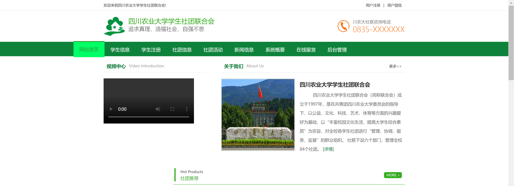
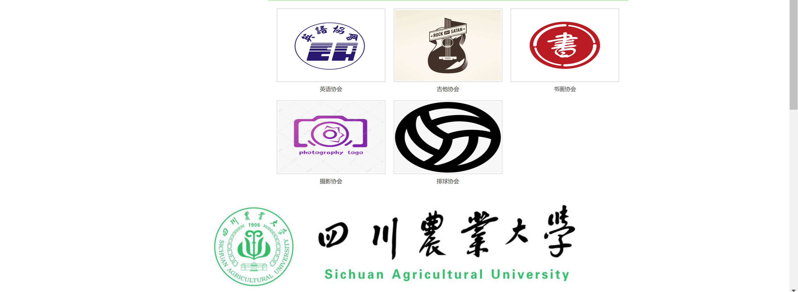
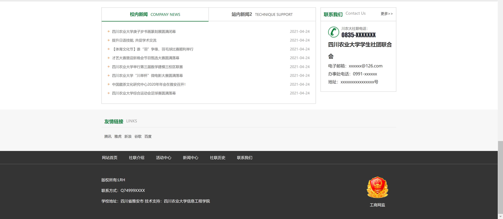
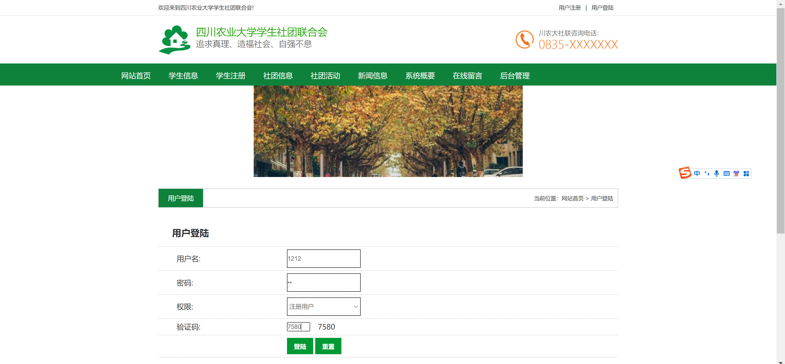
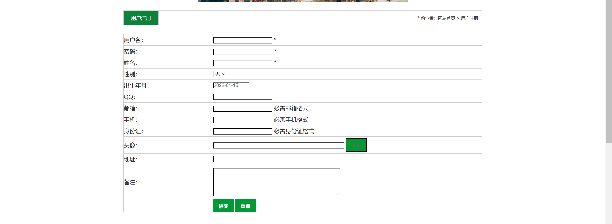
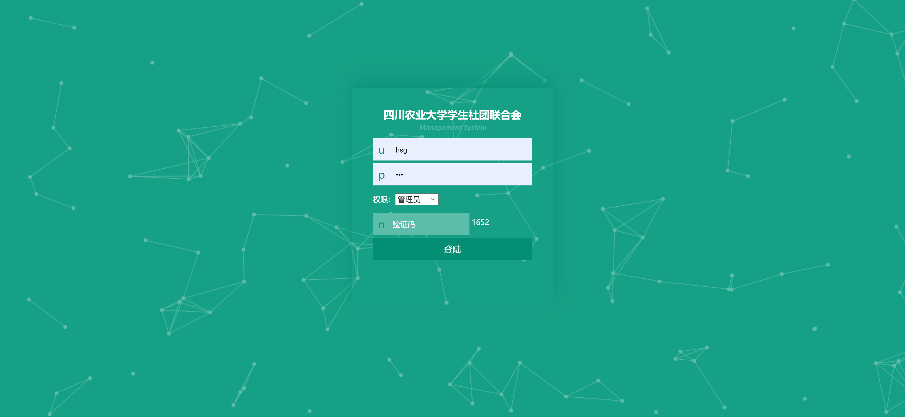
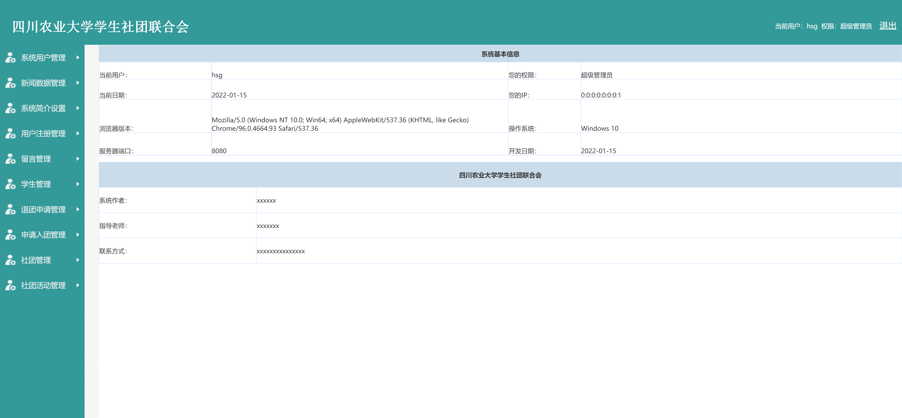
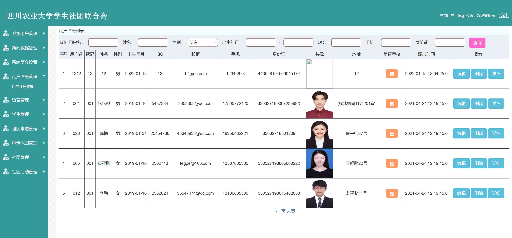
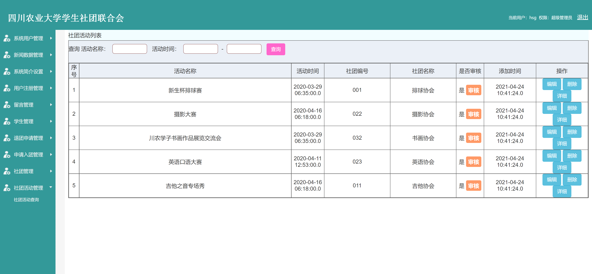

<h1 align="center">学生社团活动管理系统</h1>

## 简介
学生社团活动管理系统：角色分为管理员、用户；功能包括用户注册、社团信息管理、活动安排、成员管理、留言反馈及系统用户管理，提升管理效率和用户体验。    --计算机毕业设计源码；毕设源码；java毕业设计源码

## 联系方式

<h3 align="center">获取完整代码与数据库文件 + 微信：deepguan QQ: 86050149 QQ群: 783742310</h3>

<h3 align="center">可帮忙远程部署 包运行成功！提供远程部署、修改代码、设计文档指导、代码讲解等服务！</h3>

## 功能介绍（完整见运行截图）
管理员：基本功能包括用户注册、编辑、删除及查看详细信息，权限设置通过简单的下拉菜单实现。系统管理涵盖用户、新闻、留言、学生、退团申请、入团申请和社团管理等模块。活动管理能够查看、编辑、删除及详细检查社团活动，并可进行状态审核，提供活动安排的创建、编辑、查看和检索功能。系统信息显示详细的用户、浏览器、操作系统及开发信息，以便于高效管理。

用户：用户可以通过填写用户名、密码、选择权限及验证码进行登录注册， 上传头像并完善基本信息如联系方式及地址等。功能菜单包括查看校园新闻、公告及社团近期活动，并提供便捷的查询功能以通过条件筛选用户信息。用户可管理自己的信息和社团参与情况，使用查询功能筛选信息。界面友好直观，快速导航可实现高效的信息获取与操作。

社团成员：社团成员能查看和管理社团的基本信息及参与活动，通过系统了解具体活动安排、时间和地点，并申请加入或退出社团。个人信息及成员风采展示用于提高交流与互动，系统支持发布通知公告以保证信息及时传达。成员可通过审核模块查看活动执行状态，提高社团活动的透明度和参与度。

咨询者：咨询者通过注册页或登录页获取系统访问权限，进入页面后可浏览页面提供的各类信息与公告。页面导航清晰，含链接便捷获取高校社联联系方式。系统展现了社团的多样性及开放性，关注热点栏目展示活跃度，友情链接提供广泛信息来源，助其深入了解社团活动与校园文化。

## 运行截图

本代码来源于网络,仅供学习参考使用!

